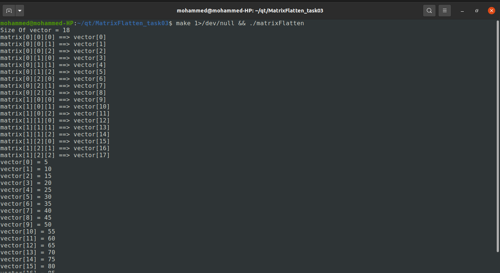

# MatrixFlatten_Task03

## Algorithm
```cpp
// Convert 3D index to 1D
int convertTo1D(int i, int j, int k)
{
   return i*m*p + j*p + k;
}
```

## Input Matrix
```cpp
// 3D Matrix
int matrix[2][3][3] = {
{{5,10,15}, {20,25,30}, {35,40,45}},
{{50,55,60}, {65,70,75}, {80,85,90}}
};
```


## Output


